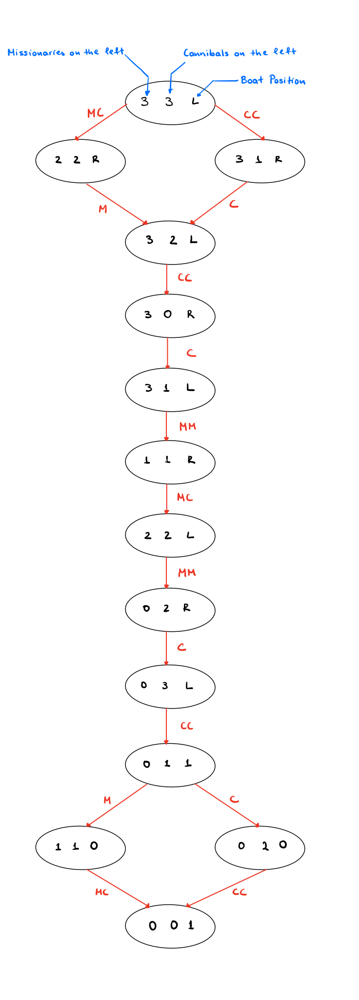

# Artifial Intelligence 

## 1st Exercise - Missionaries and Cannibals AI problem

### Τhe Nature Of The Problem
The Missionaries and Cannibals problem:

Three missionaries and three cannibals wish to cross a river using a two person boat. If at any time the cannibals outnumber the missionaries on either side of the river, they will eat the missionaries. How can a sequence of boat trips be performed that will get everyone to the other side of the river without any missionaries being eaten?

### Purpose 
The purpose of this project is to implement and solve the problem of Missionaries and Cannibals optimally using an appropriate search algorithm. 

### Implementation
A problem like this can be formulated as follows:
* **States:**
	* **Boat State (position):** original is left coast and the final is right coast.
	* **Game State (Missinaries and Cannibals):** The number of Missionaries and Cannibals in the left coast of the river.
* **Initial State:** 3 Missionaries and 3 Cannibals in the left coast of the river.
* **Successor function:** All legal states where **#Missionaries > #Cannibals** on other side from trying the five actions (MM,CC,MC,M,C).
* **Goal test (aka Goal state):** 3 Missionaries and 3 Cannibals in the right coast of the river.
* **Path Cost:** Each step costs 1, the path cost is the number of steps in the path towards the goal (Figure 1).

#### Missionaries / Cannibals Search Graph 

#### Building the Search Tree
The building of the Search Tree is based on the five actions (successor function) and it is seperated into two different categories based on the coast of the river where the boat is located(left,right)

If the boat is on the either side {Right,Left} the **Possible Moves** are:
1. Move 2 Missionaries
2. Move 2 Cannibals
3. Move 1 Missionary
4. Move 1 Cannibal
5. Move 1 Missionary and 1 Cannibal

**Attention!** All these moves lead to a legal state ONLY IF they don't violate the RULE ( *#Missionaries _> #Cannibals* ), if NOT we examine the remaining possible moves.

#### Implementing the breath-first Search
In this project I implemented a **breath-First search**.

The General Idea of Breath-First Search is to traverse the Searching Tree, examining each time all the neighboors of the current node first.

### How to run it
#### Mac / Linux

#### Windows

python main.py

